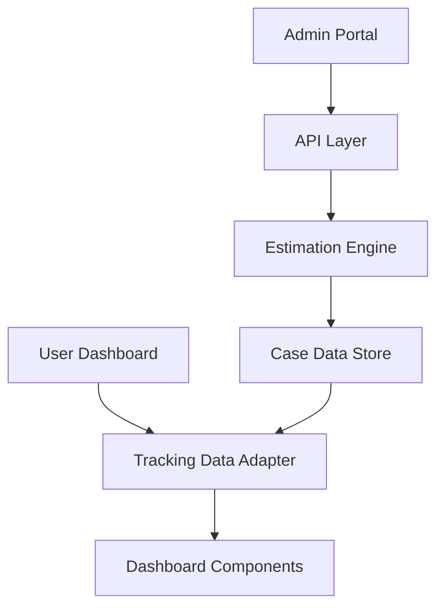

# Visa Eligibility RAG System

A comprehensive, bilingual (English/Chinese) green card eligibility and case tracking system with AI-powered assistance.

## 🌟 **System Overview**

This application provides end-to-end support for green card applicants with two main components:

### 🏠 **Dashboard Interface**
- **Interactive Case Tracking**: Real-time progress monitoring with visual timelines
- **Bilingual Support**: Full English and Chinese (Simplified) interface
- **Smart Notifications**: Automated alerts for upcoming deadlines and requirements
- **Document Management**: Centralized access to forms, checklists, and resources
- **Mobile Responsive**: Optimized for desktop, tablet, and mobile devices

### 🛠️ **Admin Portal**
- **Case Management**: Comprehensive admin interface for updating case stages
- **Real-time Updates**: One-click stage completion with automatic recalculation
- **Analytics Dashboard**: Case overview and distribution statistics
- **Estimation Engine**: AI-powered completion date predictions

## 🚀 **Quick Start**

### Prerequisites
- Node.js 18+
- npm or yarn

### Installation & Setup
```bash
# Clone the repository
git clone <repository-url>
cd visa-eligibility-rag

# Install dependencies
npm install

# Start development server
npm run dev
```

### Access the System
- **User Dashboard**: `http://localhost:3000`
- **Admin Portal**: Click 🛠️ button → "Admin Portal" or visit `/admin`

## 📊 **Features**

### 🎯 **Dashboard Features**
- ✅ **Case Summary Card** with progress visualization
- ✅ **Interactive Timeline** with expandable details and tooltips
- ✅ **Smart Alerts** with filtering (all, unread, important)
- ✅ **Document Center** with FAQs and downloadable resources
- ✅ **Bilingual Interface** (English/Chinese) with proper typography
- ✅ **Mobile Responsive** design with adaptive navigation

### 🔧 **Admin Portal Features**
- ✅ **Case Overview** with stage distribution statistics
- ✅ **One-Click Stage Updates** with automatic estimate recalculation
- ✅ **Detailed Case Management** with comprehensive case information
- ✅ **Notes and Audit Trail** for administrative tracking
- ✅ **Real-time Synchronization** between admin and user interfaces

### 🧠 **Intelligent Features**
- ✅ **Estimation Engine** with visa type and processing center specific calculations
- ✅ **Country-Specific Delays** for China/India-born applicants
- ✅ **Confidence Levels** (high/medium/low) for predictions
- ✅ **Dynamic Alerts** based on case status and upcoming deadlines
- ✅ **Processing Time Analysis** using historical data patterns

## 🗂️ **Case Tracking System**

### **Stage Lifecycle** (10 Comprehensive Stages)
1. **Form I-130/I-140 Filed** - Initial petition submission
2. **USCIS Receipt Notice** - Confirmation received (1-3 weeks)
3. **Biometrics Completed** - Fingerprints and photos (3-6 weeks)
4. **EAD/AP Issued** - Work authorization (2-4 months)
5. **Case Transferred** - Between USCIS offices (1-4 weeks)
6. **Interview Scheduled** - Notice sent (3-10 months)
7. **Interview Completed** - Adjustment interview (1-2 months)
8. **Green Card Approved** - Final approval (1-2 weeks)
9. **Green Card Produced** - Physical card creation (1-2 weeks)
10. **Green Card Delivered** - Card delivery (3-7 days)

### **Smart Estimation Algorithm**
- **Historical Data Analysis**: Processing times by visa type and center
- **Country Backlog Integration**: Automatic delay application for affected countries
- **Dynamic Recalculation**: Real-time updates when stages are completed
- **Confidence Assessment**: Based on data quality and case characteristics

## 🏗️ **Technical Architecture**

### **Frontend Stack**
- **Next.js 15** - React framework with App Router
- **TypeScript** - Type-safe development
- **Tailwind CSS** - Utility-first styling with custom components
- **React i18next** - Internationalization support
- **Inter + Noto Sans SC** - Optimized typography for English/Chinese

### **Backend Architecture**
```
src/
├── app/api/tracking/          # RESTful API endpoints
│   ├── cases/route.ts        # Case CRUD operations
│   ├── stages/route.ts       # Stage management
│   └── populate/route.ts     # Sample data management
├── types/tracking.ts          # Comprehensive type definitions
├── utils/estimationEngine.ts # AI prediction algorithms
├── data/trackingConfig.ts     # Processing time configurations
└── components/               # React components
    ├── Dashboard.tsx         # Main user interface
    ├── AdminPortal.tsx       # Admin management interface
    └── [other components]    # Specialized UI components
```

### **Data Flow**


## 📱 **Mobile Optimization**

- **Responsive Design**: Mobile-first approach with breakpoints at 640px, 1024px
- **Touch Interactions**: Optimized touch targets and gestures
- **Adaptive Navigation**: Tab system becomes dropdown on mobile
- **Typography Scaling**: Appropriate text sizes for different screen sizes
- **Safe Area Support**: Handles device-specific safe areas

## 🔗 **API Documentation**

### **Key Endpoints**
```bash
# Case Management
GET    /api/tracking/cases           # List all cases
POST   /api/tracking/cases           # Create new case
PUT    /api/tracking/cases?id=:id    # Update case

# Stage Management  
POST   /api/tracking/stages/complete # Mark stage complete
GET    /api/tracking/stages/updates  # Get recent updates

# Data Management (Demo)
POST   /api/tracking/populate        # Populate sample data
GET    /api/tracking/populate        # Check data status
```

## 🧪 **Sample Data**

The system includes 3 comprehensive sample cases for demonstration:
- **EB-2 Case** (China-born, Stage 3 - Biometrics Completed)
- **EB-1 Case** (India-born, Stage 7 - Interview Completed)
- **EB-3 Case** (Philippines-born, Stage 2 - Receipt Notice)

## 📋 **Current Status & Roadmap**

### ✅ **Completed Features**
- Full dashboard UI with all requested components
- Complete admin portal with case management
- Intelligent estimation engine with country-specific delays
- Real-time updates and synchronization
- Comprehensive sample data and documentation
- Mobile-responsive design with proper internationalization

### 🔄 **Future Enhancements** (Not Currently Implemented)
- **Gantt Chart Timeline**: Interactive calendar view with Recharts
- **Chatbot Integration**: Connection to existing RAG API
- **User Comparison**: Statistical comparisons with other applicants
- **Push Notifications**: Email/SMS notification system
- **Database Integration**: Replace in-memory storage with persistent database
- **Authentication System**: User and admin access control

## 🛠️ **Development**

### **Project Structure**
```
visa-eligibility-rag/
├── src/app/                  # Next.js app directory
├── src/components/           # React components
├── src/types/               # TypeScript definitions
├── src/utils/               # Utility functions
├── src/data/                # Configuration and sample data
├── README_DASHBOARD.md      # Dashboard documentation
├── README_TRACKING_SYSTEM.md # Tracking system documentation
└── package.json             # Dependencies and scripts
```

### **Development Commands**
```bash
npm run dev     # Start development server
npm run build   # Build for production
npm run start   # Start production server
npm run lint    # Run linting
```

## 📝 **Documentation**

- **[Dashboard Documentation](README_DASHBOARD.md)** - Comprehensive UI component guide
- **[Tracking System Documentation](README_TRACKING_SYSTEM.md)** - Complete tracking system guide

## 🤝 **Contributing**

This system provides a solid foundation for production green card case management with extensive customization possibilities based on specific organizational needs.

## 📄 **License**

[Add your license information here] 